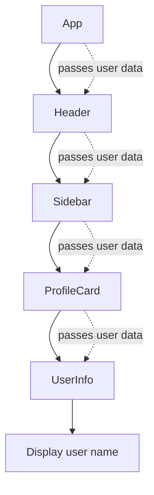

# React Context API App

This project is a small React + Vite application built to demonstrate the difference between prop drilling and the Context API. It focuses on how state moves through component trees and how Context helps avoid passing props through many intermediate layers.

## Overview

React applications often need shared data such as:

- user information
- theme settings
- authentication state
- language or localization values

When that data is passed from parent to child through several nested components, the pattern is called prop drilling. Context API offers a cleaner alternative when the same data is needed in multiple nested components without manually forwarding props at every level.

## Project Structure

```bash
react-contextAPI-app/
├── public/
├── src/
│   ├── App.css
│   ├── App.jsx
│   ├── assets/
│   ├── index.css
│   └── main.jsx
├── .gitignore
├── eslint.config.js
├── index.html
├── package.json
├── vite.config.js
├── README.md
└── public/
```

## Key Concepts

### 1. Prop Drilling

Prop drilling happens when a value is passed down through multiple levels of components, even though some of the intermediate components do not actually need the data.



#### Problems with prop drilling

- prop names must be passed through many components
- intermediate components become cluttered with unrelated props
- refactoring becomes harder and riskier
- components are less reusable

### 2. Context API

Context API lets a parent component provide data once, and any descendant can access it without passing props through every level in between.

```mermaid
flowchart TD
    A[App] --> P[UserContext.Provider]
    P --> B[Header]
    P --> C[Sidebar]
    P --> D[ProfileCard]
    P --> E[UserInfo]

    D -->|useContext(UserContext)| F[Reads user data directly]
    E -->|useContext(UserContext)| G[Reads user data directly]
```

This makes data access simpler when many components need the same state.

## Typical Context API Flow

```jsx
const UserContext = React.createContext();

function App() {
  const [user] = useState({ name: 'Alex' });

  return (
    <UserContext.Provider value={user}>
      <Layout />
    </UserContext.Provider>
  );
}

function ProfileCard() {
  const user = useContext(UserContext);
  return <h1>Hello, {user.name}</h1>;
}
```

## When to Use Context API

Use Context API when:

- several components need the same data
- the data is shared across a branch of the component tree
- you want to reduce prop forwarding noise

Use local state when:

- the state belongs only to one component
- the data is not shared beyond a small subtree

## Best Practice

Context is very useful, but it should not replace every case of state management. A good rule is:

- local state for local UI behavior
- props for direct parent-to-child communication
- Context for shared app-wide values
- Redux or another state library for larger, more complex application state

## Quick Summary

- Prop drilling: data is passed down manually through many layers
- Context API: data is provided centrally and consumed directly
- Result: cleaner code, fewer props, easier access to shared state

## Run the App

```bash
npm install
npm run dev
```

Then open the local Vite URL shown in the terminal to view the app in the browser.

## Learning Goal

This app is meant to help you understand how shared state flows in React and when it is better to use Context instead of passing props through multiple nesting levels.