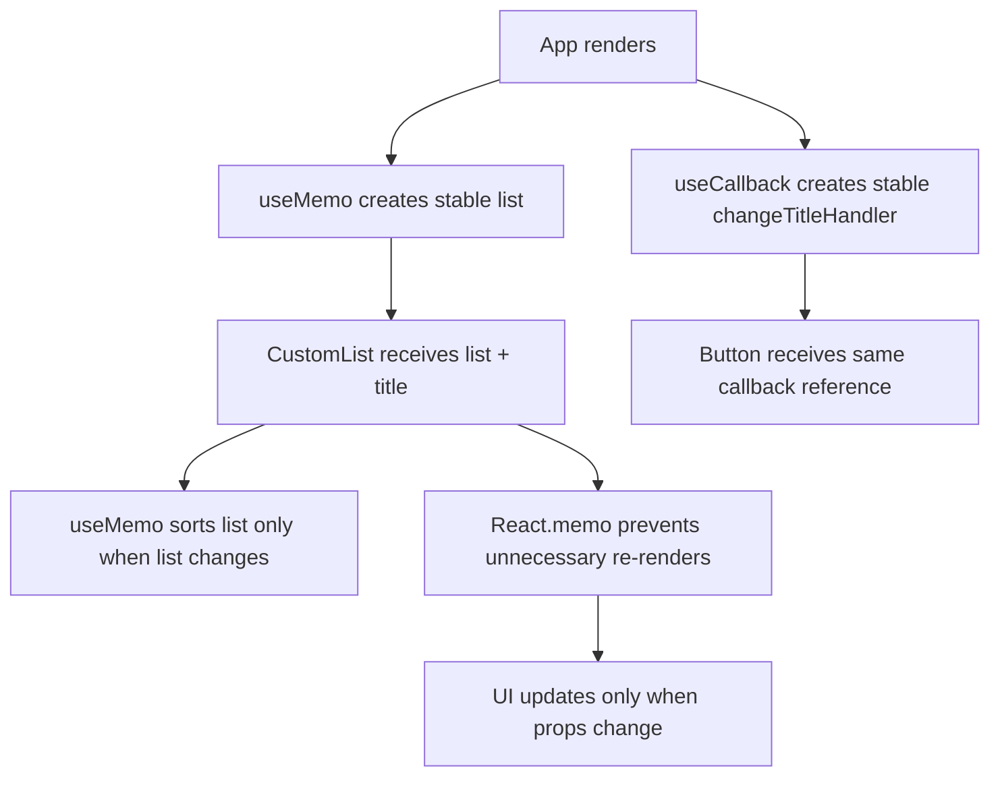

# React Hooks: memo, useMemo, and useCallback

This project demonstrates a practical use case for `React.memo`, `useMemo`, and `useCallback` in a React app.

## Why these hooks are used

React re-renders components whenever the parent re-renders or the state changes. In some cases, this causes unnecessary work:

- heavy computations
- sorted data recalculation
- function recreation
- child re-renders even when props did not change

These hooks help reduce unnecessary work and improve performance.

## 1. `memo`

`React.memo` prevents a component from re-rendering if its props have not changed.

In this project:

```tsx
export default React.memo(CustomList);
```

This means `CustomList` will not re-render unless the `title` or `list` props change.

### Use case

Use `memo` for components that:

- receive stable props
- do expensive rendering
- are used in lists or dashboards
- do not need to re-render often

## 2. `useMemo`

`useMemo` memoizes the result of a computation.

In `CustomList.tsx`:

```tsx
const sortedList = useMemo(() => {
  console.log("SortedList Method Called!");
  return list.sort((a: number, b: number) => a - b);
}, [list]);
```

### Why it matters

Without `useMemo`, the sort runs again every time the component renders.

With `useMemo`, sorting is only recalculated when `list` changes.

### Best use case

Use `useMemo` for:

- sorting large arrays
- filtering large lists
- expensive computations
- values derived from props or state

## 3. `useCallback`

`useCallback` memoizes a function so it keeps the same reference between renders when dependencies do not change.

In `App.tsx`:

```tsx
const changeTitleHandler = useCallback(() => {
  setTitle("New Title!!");
}, []);
```

### Why it matters

The function reference remains stable. This helps avoid unnecessary child re-renders when the child receives a callback prop.

### Best use case

Use `useCallback` for:

- callback props passed to memoized children
- event handlers that do not need to change often
- avoiding function recreation on every render

## Real example in this project

### App component

```tsx
const [title, setTitle] = useState("Default Title!");

const changeTitleHandler = useCallback(() => {
  setTitle("New Title!!");
}, []);

const listItems = useMemo(() => {
  return [2, 4, 3, 1, 5];
}, []);
```

### CustomList component

```tsx
const sortedList = useMemo(() => {
  return list.sort((a, b) => a - b);
}, [list]);
```

### Button component

```tsx
const Button = (props: ButtonProps) => {
  return <button onClick={props.onClick}>{props.children}</button>;
};
```

This pattern is useful because:

- the list is only created once
- the sort is only repeated when the list changes
- the title update callback is stable
- the child list does not re-render unless necessary

## Visual flow



## Important difference

- `memo` → memoizes the component
- `useMemo` → memoizes a computed value
- `useCallback` → memoizes a function

## When not to overuse them

These hooks are not always necessary. They should be used when there is a real performance issue or repeated expensive work.

Do not add them everywhere because:

- they add complexity
- they may cause code to be harder to read
- they are only useful when the cost of re-rendering is meaningful

## Summary

This project shows a simple performance optimization pattern:

- `memo` prevents unnecessary component re-renders
- `useMemo` prevents expensive value recalculation
- `useCallback` keeps callback references stable

This is especially helpful in lists, large forms, dashboards, and components receiving callback props.
